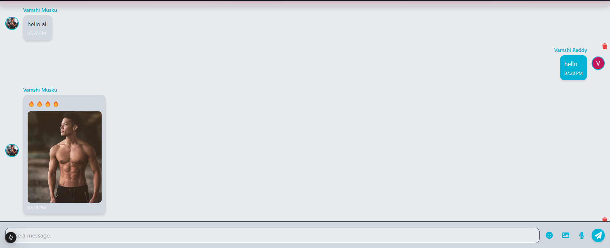
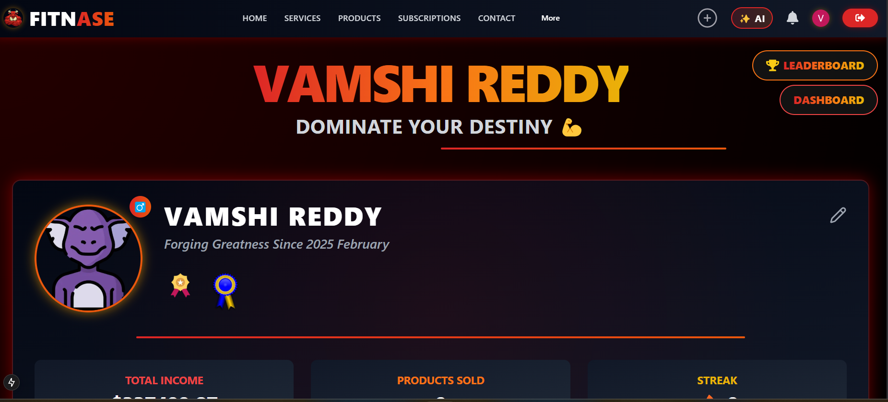
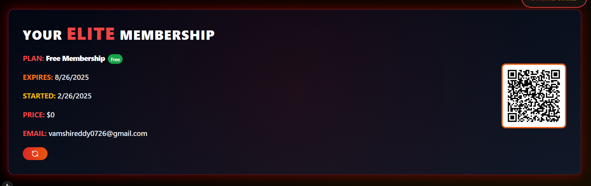
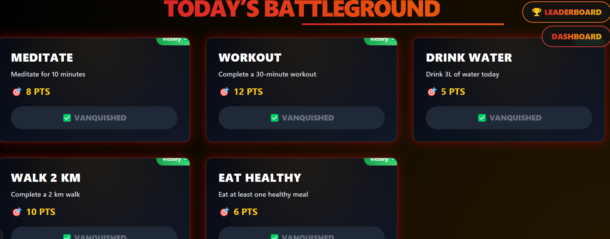
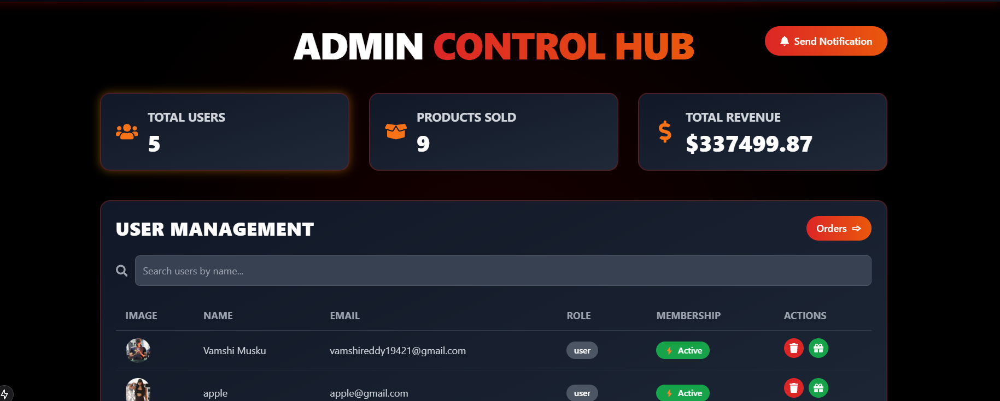
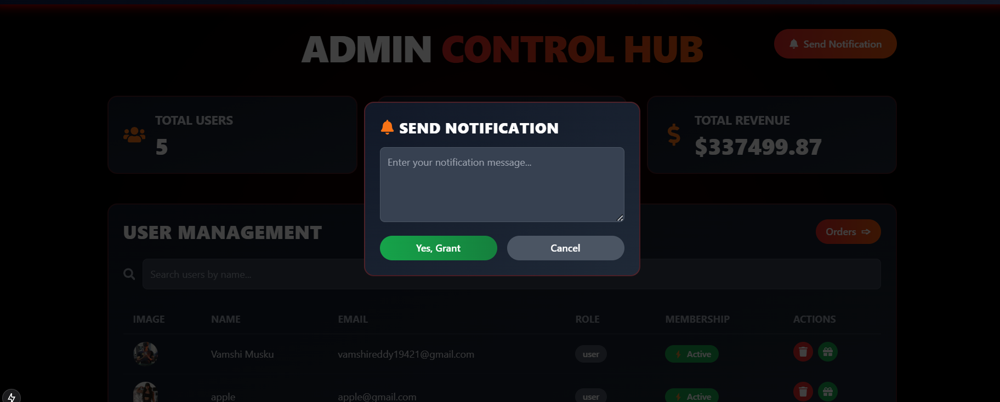
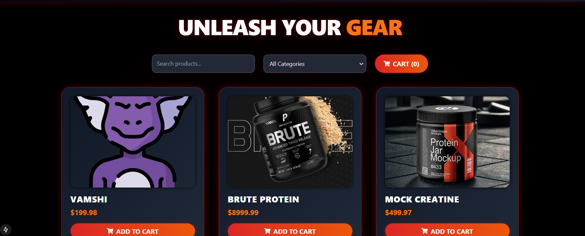
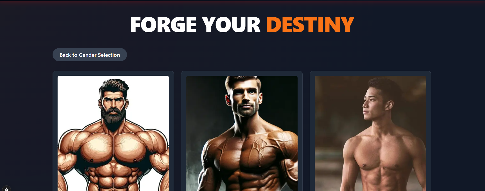
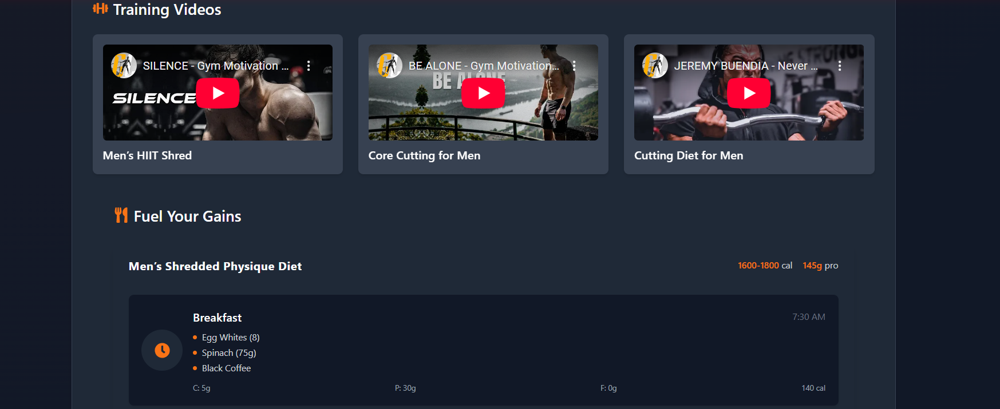
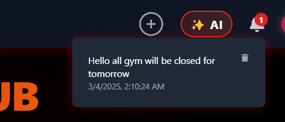

# ✨ Fitnase - Ultimate Gym Management App ✨  
  

Welcome to **Fitnase**, a powerful gym management web application that enhances both **admin** and **user** experiences with advanced features, real-time interactions, and a seamless fitness journey.  

## 🚀 Features  

### **For Admins**  
✅ Create and manage **products, subscriptions, and bills**  
✅ Manage **users** and assign **free memberships**  
✅ Track and **manage orders**  
✅ Send **notifications via email** to users  
✅ Monitor user progress through **leaderboards**  
✅ Many more powerful tools to keep your gym running smoothly  

### **For Users**  
✔ Buy **subscriptions** and **products**  
✔ **QR-based login** for easy gym access  
✔ Earn **streak points** and complete **daily fitness activities**  
✔ **AI-powered assistant** for fitness guidance  
✔ **Real-time group messaging** with **Socket.io**  
✔ Receive **notifications** for updates and reminders  
✔ **Login, Logout, Sign Up** for secure access  
✔ Access **diet plans, workout plans, and gym timetables**  
✔ **BMI calculator** for health tracking  
✔ Edit and customize **profile settings**  
✔ **Track orders** and membership details  
✔ View **leaderboard rankings** and fitness achievements  

## 🛠 Tech Stack  

- **Next.js** – For full-stack power and smooth UI  
- **NextAuth.js** – Secure authentication (including Google OAuth)  
- **TailwindCSS** – Clean, modern, and responsive styling  
- **Framer Motion** – Smooth animations and effects  
- **Cloudinary** – Seamless image uploads  
- **Socket.io** – Real-time chat and notifications  
- **MongoDB** – Scalable database for users, subscriptions, and products  
- **Zod + React Hook Form** – Powerful form validation  
- **React Hot Toast** – Interactive feedback messages  

## 🏗 Setup  

### **1️⃣ Clone the Repository**  
```bash
git clone https://github.com/VamshiReddy143/gym.git
cd gym
```

### **2️⃣ Install Dependencies**  
```bash
npm install
```

### **3️⃣ Configure Environment Variables**  
Create a `.env.local` file and add the required credentials:  
```ini
NEXT_PUBLIC_GEMINI_API_KEY=YOUR_KEY

MONGODB_URI=YOUR_DATABASE_URI

GOOGLE_CLIENT_ID=YOUR_CLIENT_ID
GOOGLE_CLIENT_SECRET=YOUR_SECRET
NEXTAUTH_SECRET=YOUR_SECRET

EMAIL_USER=YOUR_EMAIL
EMAIL_PASS=YOUR_PASSWORD

JWT_SECRET=YOUR_JWT_SECRET

STRIPE_SECRET_KEY=YOUR_STRIPE_KEY

NEXT_PUBLIC_CLOUDINARY_CLOUD_NAME=YOUR_CLOUDINARY_NAME

NEXT_PUBLIC_SOCKET_URL=http://localhost:4000
SOCKET_PORT=4000
```

### **4️⃣ Start the App**  

For development:  
```bash
npm run dev
```

For production:  
```bash
npm run build
npm start
```

## 📸 Screenshots  

 
 
 
 
 
 
 
 
 
 
 
 
 
 


## 🌍 Deployment  

Deploy your app easily using **Vercel**:  

1. Push the repo to GitHub  
2. Connect the repo to [Vercel](https://vercel.com/)  
3. Add **environment variables**  
4. Deploy & go live! 🚀  

